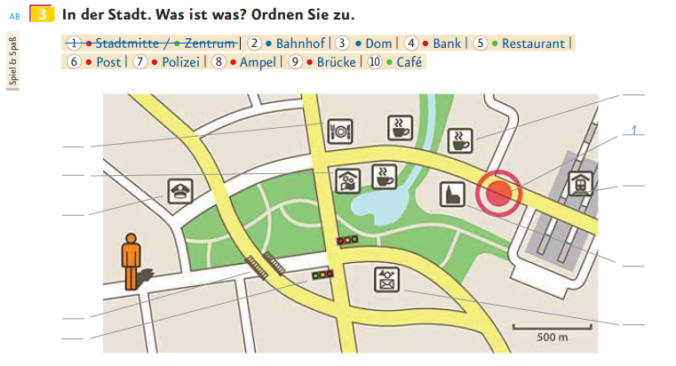
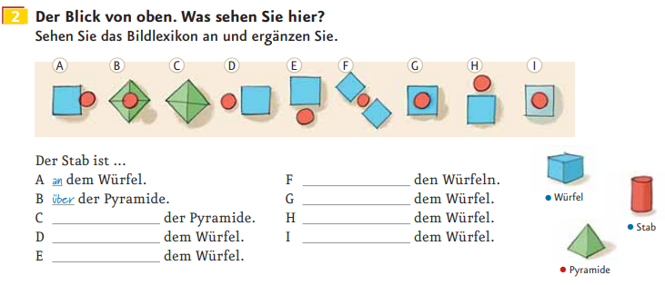

# 교양독일어중급

------

## 2019.03.06

### 발음 체크

- Edles Metall, Brilliante Technik. Das neue U900 Soul von Samsung
- 고품격의 메탈, 눈부신 테크닉. 삼성의 새로운 U900 소울

## 2019.03.08

- 각 과의 첫 네 페이지만 진도 나간다.
- 앞 타임 홀수과, 뒷 타임 짝수과로 진행된다.

### 본문

- Zu wem passt das? - 누구에게 맞는가?
- Kreuzen Sie an. - x표시 하세요
- Hilfe finden Sie im Bildlexikon. - 그림 사전에서 도움을 받으세요.
- Das Haus ist groß und elegant. - 집이 크고 세련되다.
- Das Haus ist klein und gemütlich. - 집이 작고 아늑하다.
- Im Garten sind viele Blumen. - 정원에 꽃이 많다.
- Im Garten steht ein Baum. - 정원에 나무가 있다.
- Das Haus hat viele Fenster. - 집에 창문이 여러 개 있다.
- Das Haus hat eine Treppe. - 집에 계단이 있다.

### 문법

#### 단문

- Subjekt + Verb
- Subjekt + Verb + Objekt
- Subjekt + Verb + Objekt + p.p(Präpositionalphrase - 전치사구)
- Subjekt + Verb + p.p

#### 명령문

- Infinitiv + Sie (높임말 명령 표현)
  - Sehen Sie (an). - (잘)보세요.
  - Sehen Sie die Häuser auf dem Bild an. - 그림 속 집들을 보세요

#### 정관사

|      남성      |    여성    |      중성      |      복수       |
| :------------: | :--------: | :------------: | :-------------: |
|   der Vater    | die Mutter |    das Haus    |   die Häuser    |
| des Vater**s** | der Mutter | des Haus**es** |   der Häuser    |
|   dem Vater    | der Mutter |    dem Haus    | den Häuser**n** |
|   den Vater    | die Mutter |    das Haus    |   die Häuser    |

#### das의 쓰임

1. 중성명사 앞 정관사 (1격, 4격)
2. 지시사 (이것, 그것)

#### 어순 규칙

- 주어나 동사가 아닌 다른 문장 성분을 강조해 표현할 수 있다.
- 이러한 표현이 문장의 맨 앞에 오면 그 뒤에 동사 + 주어가 온다.
  - ex) Sie finden Hilfe im Bildlexikon
  - = Hilfe finden Sie im Bildlexikon

#### 동사의 어미변화

- stehen

ich stehe

du stehst

er/sie/es steht

wir stehen

ihr steht

sie/Sie stehen

## 2019.03.13.

- 교재 7페이지 3번 지도 시험 출제

> 

- 장소 관련 전치사(lokale Präpositionen)
  - auf : 접촉면 o 위
  - an : 곁, 붙어서 (접촉)
  - neben : 근처에, 옆에
  - vor : 앞에
  - hinter : 뒤에
  - zwischen : 사이에
  - über : 접촉면 x 위
  - unter : 아래에
  - in : 안에

- 각 과의 1, 2, 3, 4, 5(a, b), 9(b), Grammatik 을 보게 된다.

###  2번 전치사 연습

> 

- 답 : an, über, unter, neben, vor, zwischen, auf, hinter, in

### Zungenbrecher

> Fischers Fritz fischt frische Fische
>
> Frische Fische fischt Fischers Fritz

## 2019.03.15.

#### 본문

Maria : Das ist Ottos Haus. - 여기가 오토네 집이야.

Elena : Hey. Das ist aber groß! Wie viele Zimmer hat sein Haus denn? - 이봐, 엄청 크잖아! 대체 방이 몇 개나 있는 거야?

Maria : Das weiß ich nicht. Warte mal! Hier vorne links ist die Küche, dahinter ist Ottos Arbeitszimmer und rechts ist sein Wohnzimmer. - 나도 몰라. 기다려 봐! 여기 앞쪽 왼편에 부엌이 있고, 그 뒤에 오토의 작업실이 있고, 오른쪽엔 거실이야.

- dahinter => da(바로 앞 명사) + hinter(뒤에)

Elena : Also drei Zimmer unten im Erdgeschoss. Und oben? - 그러니까 1층에는 방이 3개네. 윗층은?

Maria : Im ersten Stock gibts zwei Schlafzimmer und zwei Kinderzimmer. - 2층에는 침실 두 개랑 애들 방 두 개가 있어.

Elena : Vier oben plus drei unten ... das sind sieben ... sieben Zimmer! Boah, ganz schön viele! - 위에 넷에 아래 셋이면 ... 7개네.. 방이 7개! 우와, 엄청 많다!

Maria : Da oben ist sein Balkon. Und da hinten ist seine Garage und sein Auto! 저 위쪽이 발코니야. 그리고 저 뒤에 차고랑 차가 있어!

Elena : Wow, Ottos Auto sieht cool aus! 우와, 오토 차 멋있다.

Maria : Und sein Haus? Wie findest du Ottos Haus? 집은? 오토네 집은 어떻게 생각해?

Elena : Sein Haus finde ich schön. Aber seinen Garten mag ich nicht so. 집도 멋지다 생각해. 그렇지만 정원은 그저 그래.

Maria : Warum nicht? 왜?

Elena : Na ja, weißt du, da sind ja nicht mal Blumen! 글쎄, 뭐랄까, 꽃이 하나도 없잖아!

Maria : Genau das hat meine Mama auch gesagt. Sie meint, hier fehlt 'ne Frau. 우리 엄마가 완전 똑같이 말했어. 엄마 말로는, 여기엔 여자가 없대.

Elena : Was ist denn mit Ottos Frau? Ist er geschieden oder was? 오토 부인은 어쩌구? 이혼이라도 한거야 뭐야?

Maria : Seine Frau? Otto hat keine Frau. 부인? 오토는 부인이 없어.

Elena : Was? Aber von wem sind denn dann seine Kinder? 뭐라구? 그럼 대체 애들은 누구 애야?

Maria : Seine Kinder? 애들?

Elena : Na ja, da sind doch Zwei Kinderzimmer, oder? 글쎄, 애들 방이 두개나 있지 않았어?

Maria : Ja, aber er hat noch keine Kinder. Er möchte gerne welche, aber ... 응, 그렇지만 애는 없어. 갖고 싶다고는 하는데...

Elena : Okay! Dann braucht er jetzt eine Frau! Zum Beispiel seine Nachbarin. 그래! 그럼 오토에겐 여자가 필요해! 예를 들면 이웃집 여자!

Maria : Vanilla? Meinst du? 바닐라? 진심이야?

Elena : Die ist doch lieb, oder? 그래도 사랑스럽지 않니?

Maria : Na ja, schon. 글쎄, 뭐.

Elena : Und sieh mal, da! Vanillas Garten! Die vielen Blumen! 그리고 저기 봐! 바닐라네 정원! 꽃이 많아!

Maria : Du, weißt du, was ich glaube? ... 너, 내가 무슨 생각하는지 알아? ...

#### 문법

##### 명령문

- 동사 어간 + (e)
  - komm schon!
  - geh weiter!
  - wart**e** mal!

##### es gibt + 4격 명사

- ~이 있다, 존재하다.
- es는 비인칭 주어로, 해석되지 않는다.

## 2019.03.19.

>  Ich verstehe nur Bahnhof

- '난 도통 모르겠어.'
- 1차 세계대전 때에 군인들에게 지시를 내리는데, 딴짓하고 안듣고 있다가 역 얘기만 나오면 집중하고 듣더라.

### 3격을 쓰는구나!

- An den Cafes fahren Sie vorbei

- Unter der Brücke kommen Sie durch

- 비분리전철과 함께 쓰이는 fahren/kommen이 운동성을 띔에도 불구하고 3격과 결합한다.

> Hierzu sagt man:
>
> Wo = Ort
>
> Wohin = Richtung
>
>
> Der "Ort", unter dem sie durchkommen, ist hier die statische Brücke.  

- 한국어 문법으론 다리 아래'로' 이니까 4격을 쓸 것 같은데, 지나오는 시점의 화자가 다리 아래'에' 있으니까 그렇게 사용하는 것 같다.
- 좀더 단순하게 보자면, 분리전철이 이미 운동성을 내포하고 있기 때문에(?) 중복해서 쓰지 않는 것일 수도 있겠다.

