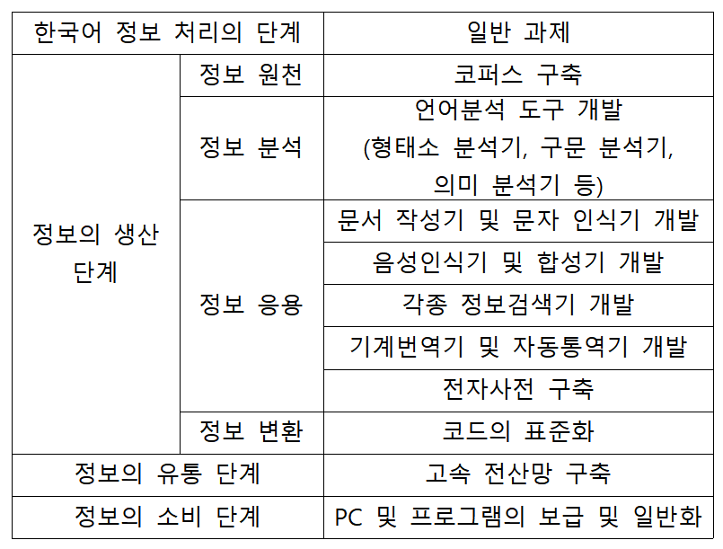

# 한국어 정보처리

------

## 2019.03.06

- '한국어 정보 처리 입문' 교재 참고
- 80년대 시작, 90년대 활발히 연구하여 2005년도 쯤부터 정리된 내용들이 책으로 출간 (입문서)
- 그런데 이제는 연구분야가 깊고 상세해져서 입문으로는 포괄할 수 없게 되었다.

### 언어란 무엇인가

1. 기호로서의 언어

- '형식'+'내용'
- '기표'+'기의'
- 이미지도 기호, 언어는 기호의 한 종류
- 형식은 음성 언어 / 문자 언어, 내용은 의미

### 정보란 무엇인가

- '정보'라는 단어가 쓰이는 맥락은 시대에 따라 다양하게 변화해왔다

>  '자료를 특정한 목적에 따라 가공하여 얻게 되는 여러 가지 사실들'

#### Q. 데이터와 정보는 무엇이 다른가?

- 데이터는 가공되지 않은 사실들의 모음 

>'특정한 목적에 따라 가공되지 않은 상태의 단순한 여러 가지 사실들'

- 이 자료를 가지고 평균, 표준편차 등을 구해 **유의미**한 결론을 도출해내는 것이 정보(특정한 목적이 존재)

> 情報 : '내 마음속에 있는 것을 명시적인 형태로 만들어 남에게 알린다'

- 컴퓨터에게 언어에 대한 지식을 습득시키려면 사실 명시적이고 분명한 기준을 컴퓨터에게 제시해주어야 한다. 이것이 정보 처리의 기초가 된다.

#### Q. 정보와 지식은 또 어떻게 다른가?

- 알아낸 정보가 **보편적**으로 의미가 있다면 이를 '지식'이라고 한다.
- 즉, 일반적으로 통용될 수 있는 정보를 지식이라고 한다.

### 정보를 받아들이는 과정

- 앞서 말한 정의처럼 '유의미'한 정보만 우리에게 받아들여지게 된다.
- 즉, 데이터가 많다고 해서 그것이 다 내게 정보로 작용하는 것은 아니다.
- 예전에는 데이터가 많지 않았기 때문에 데이터 구축이 하나의 과제였는데, 지금은 이미 축적된 데이터가 너무나 많다.

> "너는 나에게 데이터가 아니라 정보야"

### 정보 처리란 무엇인가

- 인간이 얻는 정보의 83%는 시각 정보이다. (prof Sampath)

> '정보를 얻고 기억하고 생산하고 유통하는 모든 과정을 정보처리라고 한다.'

- 현대에 이르러 정보의 양이 기하급수적으로 늘어났다.
- 인간은 신체적 정보 처리의 한계를 극복하기 위해 매체를 만들어냈다.
- 전화, 팩스, 녹음기, 라디오, 신문, TV, 컴퓨터가 그러한 예이다.
- 사실상 현대에 이루어지는 정보 처리의 절대 다수는 컴퓨터를 이용해 이루어진다.

### 정보 처리 과정

​							`데이터 -> 정보 -> 표현`

​					    	`input -> process -> output`

- 위 모델을 IPO 모델이라고 한다.
- 데이터가 정보가 되려면 의미가 있어야 한다.
- 정보는 기호로 인코딩되어 표현되어야 한다.
- 실제 프로그래밍 관련 전공에서 관심을 가지는 정보 처리의 절차는 정보를 표현하는 절차이다.
- 신경망을 이용해 이미지를 분석하는 알고리즘도 이러한 절차 중 하나이다.

### 한국어 정보처리

- 1980년대 중반 이후에 등장
- 컴퓨터를 이용해 연구자료를 정리한다는 의미의 도구로서 접근(기계화/전산화 수준)
- 이후 한국어 정보학의 개념이 도입
- 정보화가 도구가 아닌 그 자체의 목표로 부각되기 시작했다.
- 컴퓨터에 인간의 언어능력을 부과하기 위한 목적으로 연구 ... 전산언어학/자연어 처리
- 본래는 데이터 정제는 연구자가, 데이터 표현은 개발자가 하는 식의 협업 구도였으나, 요 근래에는 풀스택을 요구하는 경우가 많다.

### 언어 행위와 정보 전달 행위

​         					`발화 행위 -> 음파 -> 청취 행위`

​			`정보 생산 -> 코드 변환 -> 통신 선로 -> 코드 변환 -> 정보 수신`

​					 `정보 생산자 : 인코딩	정보 수신자 : 디코딩`

- 정보 생산이란, 정보의 원천을 분석하고, 그 결과를 토대로 정보를 검색 내지 추출하는 과정이다.
- 코드 변환이란, 정보를 컴퓨터에서 활용할 수 있도록 변환하는 과정이다.

### 한국어 정보처리의 단계와 과제

> 

- 현재 한국어 형태소 분석기의 정확도는 90%정도
- 상용 기준은 95%를 목표로 한다.
- 번역 방식에도 신경망 번역방식을 적용하자 적중도가 훨씬 높아졌다고 한다.
- 구글에선 3년 안에 인간 번역자가 필요 없어질 거라고 발표했다.
- 위 단계를 아래 처럼 세 단계로 나누기도 한다.

1. 기초 분야

- 정보 원천 영역 - 코퍼스(말뭉치) 구축
- 코퍼스란, 언어 연구의 대상이 되는 텍스트 자료의 집합이다.
- 음성 자료를 다루는 코퍼스는 음성 코퍼스라고 지칭한다. => 난이도가 차원이 다르다
- 코퍼스 구축만 해도 굉장히 비싸다!
- cf) 음성 코퍼스 중 사용할 수 있는 유일한 자료는 '서울 코퍼스'

2. 핵심 분야

- 정보 분석 영역 - 언어 분석 도구 개발 영역
- 인간이 언어를 인지하는 인지 과정과 유사한 과정

3. 응용 분야

- 정보 변환 영역
- ㅁ

### 마지막으로

- 은행원의 업무 : 금액에 비례하는 이자율을 매겨 이자를 지급하는 업무 ... 반복 업무
- 이 반복 업무를 기계를 통해서 신속하게 처리하는 것이 컴퓨터의 역할
- 단순 노동을 대체하는 일은 쉽게 진행되었으나, 인간의 지성을 구축하는 일은 쉽게 진척되지 않았다.
- 이후 신경망이 등장하면서 이 판도가 빠르게 뒤바뀌고 있다.
- weak한 인공지능 ... 특정 분야에 특화된 인공지능 (알파고, 이미지 분석기 등등)
- 그러나 아직도 컴퓨터가 해내지 못하는 일들이 상당히 많다.

## 2019.03.11.

- 지난 시간 수업 review
- 7주차 출장으로 3번 휴강 -> 팀프로젝트 시간으로 활용

### 코퍼스란 무엇인가

- 코퍼스를 대상으로 하는 학문 분야도 존재한다.

> 코퍼스란?
>
> 언어 연구의 대상이 되는 텍스트(default)의 집합

- '음성' 코퍼스처럼 수식어가 붙지 않는 한 문자 코퍼스를 일컫는 것으로 이해한다.
- 컴퓨터가 인식할 수 있는 형태의 텍스트, 즉 소스파일을 의미하는 것.
- 말뭉치, 말모듬, 코퍼스, Corpora, 대언어자료기지, Big data 등 다양한 단어로 일컬어진다.
- 넓은 의미의 코퍼스 : 어떤 종류/형식이든 글과 말을 모아놓은 것
  - 조선왕조실록CD(이미지), 이문열 전집(오프라인 북), 외국인 한국어 학습자의 오류(종이) 모음
- 좁은 의미의 코퍼스 : 컴퓨터를 이용한 언어 연구의 대상 (즉, 컴퓨터가 처리할 수 있는 텍스트 파일)
  - 신문기사, 일상대화, 특정 작가의 소설 등
  - 전자화되어 비트로 구성된 것들
- 코퍼스를 구축할 때는 활용할(필요한) 정보들만으로 구성하는 것이 중요하다. (목적지향적 설계)

### 코퍼스 언어학

- 전자 코퍼스를 바탕으로 컴퓨터를 이용하여 언어학적 연구를 수행하는 연구 방식
- 전통적 음운, 문법, 의미, 어휘의 문제를 연구하는 동시에 전자사전, 통계적 자연어 처리 등의 연구 분야를 포괄적으로 포함하는 연구 분야이다.
- #### 발화된 **실제** 언어 자료의 집합체
- <u>균형성</u>, <u>대표성</u>, <u>신뢰성</u>(출처)을 가져야 한다.
- 기계 가독형(machine readable), 전산화된 자료여야 한다.

### 코퍼스의 필요성

- 최초의 개발 동기 : 사전 편찬

- 영화 [말모이] 참조 : 자료를 모아야 사전을 만들지

- 언어 사용 양상에 대한 모국어 화자의 불확실한 직관은 객관적 기술에 방해가 될 수 있다.

> 예시)
  >
  > 아버지와 어머니 중 사용 빈도가 높은 것은?
  >
  > 가장 높은 빈도로 사용되는 한국어 명사 10개는?

### 쓸모 있는 코퍼스를 만들기 위한 조건

- 연구자가 알고자 하는 중요 언어 사실을 실제로 포착할 수 있는 것
- 목적지향적이고 필요한 정보에 치중한 정보
- 양적 지향보다는 질적 지향
- 텍스트 수집 과정에서 내용/형태를 변경하거나 누락해선 안 된다.(신뢰성)
  - ex) 음성 전사의 경우 개인의 말버릇이나 사투리를 그대로 반영해서 입력해야 한다.
- 특정한 기준에 의해 선택된 것이어야 한다.(대표성, 균형성)

### 코퍼스의 효용

- 코퍼스는 아무리 커도 크지 않다. (실제 사용하는 언어에 비하여)
- 코퍼스는 아무리 작아도 무의미하지 않다. (그 안에는 관찰할만한 사실이 존재한다)

### 코퍼스의 역사

#### 국외 코퍼스

- Brown Corpus
  - 1967년 최초의 코퍼스
  - 100만 어절 규모(띄어쓰기 단위)
    - 300쪽 짜리 소설이 대략 5만 어절 정도라고 한다.
  - 브라운 대학에서 구축
  - 대표적인 한계 : 동음이의어 분석을 하지 않았다. (모아두기만 해선 의미가 없다!)
- BNC(영국국립코퍼스)
  - 국가 차원의 개입이 필요한 공공재로서의 가치가 부각됨
  - 중복 예산과 인력 낭비의 문제를 해결하기 위함
  - 1억 어절 규모로, 지속적으로 확장되고 있다. (문자/음성이 9:1 비율)
- ANC(미국국립코퍼스)
- COCA(Corpus of Contemporary American English)
  - 접근성과 활용성이 용이하다.
  - 검색 기능을 통해 빈도, 용법 등에 대한 정보를 바로 입수할 수 있다.

#### 국내 코퍼스

- 우리나라는 1990년대부터 연구하기 시작
- 각자가 개발한 것을 공유하지 않고 있기 때문에 접근하기가 쉽지 않은 편이다.
- 21세기 세종계획 코퍼스
  - 국가 주도 최초의 코퍼스 (고려대, 연세대, KAIST, 국립국어원 등의 코퍼스를 수합하여 표준화함)
  - 1억 어절 규모
  - 영국의 BNC를 모델로 함
  - 1998~2007년 수행 => 국어 정보화의 기초 수립 (150억 규모 사업)
  - 국립국어원 언어정보나눔터에서 제공
  - 독백, 주례사, 연설, 회의 등 키워드별 제공
  - 그러나 2007년 이래로 업데이트가 되지 않고 있다. (사실상 5년 지난 자료는 폐기 대상) => 잃어버린 10년
  - 이렇게 만들어진 코퍼스는 빅데이터, 머신러닝, 인공지능 등 영역에서 필요한데, 자원이 부족한 상황
  - 올해부터 <u>향후 5년간</u> 다양한 코퍼스 구축 계획이 수립중 (4차 산업혁명)
    - 고려대 민족문화연구원, 연세대 언어정보연구원 등
    - https://riks.korea.ac.kr 민족문화연구원 사이트
    - http://corpus.korea.ac.kr 웹개발 코퍼스 분석 도구

### 코퍼스의 종류

#### 자료 유형에 따라

- 문어 코퍼스
  - 텍스트로 구성된 코퍼스
  - 문헌 본래의 텍스트 모습을 그대로 담은 이미지 파일로 구성할 수도 있음
  - 균형 코퍼스 : 문어+구어 텍스트가 균형을 이루도록 구성된 코퍼스
- 음성 코퍼스
  - 구어의 특성이나 음성에 대한 분석을 위한 음성 녹음 

#### 만든 목적에 따라

- 일반 코퍼스
  - 일반적 언어 조사를 위한 코퍼스
- 특수 코퍼스
  - 특정 목적에 맞게 고안된 코퍼스

#### 가공 여부에 따라

- 원시 코퍼스
  - 원문 텍스트 그대로
- 주석 코퍼스
  - 각종 문법적 정보를 붙인 코퍼스
  - 형태 분석 => 품사별 통계 등
  - 동음이의어 분석 => 도시 / 전치사 to와 부정사 to / 숫자 one과 대명사 one
  - 구문 분석 => 통사적 정보(문장 성분) (사실상 정확도가 굉장히 낮음)
  - 평판 분석 => 감정 분석
  - 담화 분석

#### 언어를 대표하는 방식에 따라

- 표본 코퍼스
- 전체 모집단의 대표적 샘플로 구성된 코퍼스
  - 대부분의 국어 코퍼스

#### 확장 가능성에 따라

#### 코퍼스에 반영된 언어의 시대에 따라

- 공시적 코퍼스
- 통시적 코퍼스

#### 그 외

## 2019.03.13.

- 발표 주제 선정
- 언어 분석이 가능하다면 어떤 주제도 가능하다.

### 코퍼스  준비

- 연습 삼아 작은 단위의 코퍼스를 이용해볼 것이다.
- 다음주 화요일까지 간단한 코퍼스를 가져와야 한다.
- 좋아하는 노래 약 30곡 따오기

### 코퍼스의 구축 과정

- 자료 입수 => 저작권 문제, 규모 등에 대한 설계
- 원시 코퍼스 => 헤더, 마크업
- 형태 분석 => 형태 분석 도구
- etc

#### 1. 자료 입수

- 이미 구축된 적절한 코퍼스가 있다면 활용한다.
- 21세기 세종 말뭉치는 학문적 목적으로 사용할 수 있도록 개방되어 있다.
- 그러나 대부분의 코퍼스는 입수하기가 쉽지 않다.
- 전자 텍스트 자료의 경우, 인터넷을 통해 구할 수도 있고, 신문사와 잡지사에서는 1년치 기사를 CD-ROM에 담아 판매하고 있으며, 워드 프로세서로 작성한 문서(이메일, 채팅 등)를 이용할 수도 있다.
- 갖춰야할 조건
  1. 내용의 신뢰성
     - 텍스트 수집, 표준화 등에서 오류가 없어야 한다.
     - 분석 텍스트의 경우 분석의 정확성을 보장해야 한다.
  2. 규모의 적절성
     - 해당 언어의 다양한 특성이 충분히 포착될 수 있어야 한다.
     - 1백만 어절 ~ 1억 어절 이상
  3. 표본의 대표성
     - 텍스트 장르 구성, 구성 비율 등이 해당 언어의 언어 사용 양상을 대표해야 한다.
     - 문어와 구어의 비중을 고려해야 한다.

#### 2. 원시 코퍼스

- 헤더
  - 텍스트의 서지적 특성
  - 저자, 출판사, 샘플링 방법, 수정 내용 등
  - JSON 형태로 기록된다.
  - ppt 사진 참조
- 마크업
  - 텍스트 내부 정보를 부호화하기 위한 정보
  - 문단, 제목, 저자, 날짜, 장 정보 등 -> p, head, author, date, div 태그

#### 3. 형태분석 코퍼스

- ppt 사진 참조
- 보통 엑셀을 이용해서 처리한다.
- 21세기 세종계획의 지능형 형태소 분석기를 사용한다면 품사 집합에 따른 태그를 알고 있으면 좋다.

## 2019.03.18.

### 지능형 형태소 분석기

- 블랙보드에서 다운로드
- 분석기를 활용하기 위해서는 한국어 통사 구조에 대해서 어느정도 알고 있어야 한다.
- 단어를 우선적으로 구분하기 때문에 띄어쓰기가 제대로 되어 있어야 한다.

### 단어

- 최소 자립 형식(minimal free form - bloomfield, 1933)
  - 형태론적으로 다른 요소의 도움 없이 문장에서 홀로 쓰일 수 있는 요소

> 그 / 나무 / 아직 / 안 / 심었다 (5단어)
>
> 조각구름 / 이 / 저 / 높은 / 하늘 / 에 / 걸려 / 있다 (8단어)

- 비분리성
  - 사이에 무언가를 넣어서 분리할 수 있는가?

> 큰아버지 vs 큰 아버지
>
> 전자는 분리가 불가능하지만, 큰 아버지는 큰 멋진 아버지 처럼 분리가 가능하다.

=> 최소 자립 형식 + 비분리성 = 분리성이 없는 최소 자립 형식

- 조사
  - 늘 체언에 붙어 쓰여 자립성이 없지만
  - 선행 체언의 자립성을 감안하여 단어의 범위에 포함하기도 한다
  - cf) 어미는 자체와 선행 용언이 모두 자립성이 없다.

### 형태소

- 단어보다 작은 단위

> 조각 / 구름 / 이 / 저 / 높 / 은 / 하늘 / 에 / 걸 / 리 / 어 / 있 / 다 (13형태소)

- 더 이상 분석하면 뜻(기능)을 갖지 못하는 요소

- 뜻을 가지는 가장 작은 요소를 형태소라고 정의할 수 있다.

- 최소의 의미 단위(minimal meaningful unit)
  - 어휘적 의미 : 하늘, 맑-
  - 문법적 의미 : 이, -다

- 형태소의 구분

  - 자립 형태소 : 문장에서 홀로 쓰이는 형태소

  - 의존 형태소 : 다른 형태소에 의존하는 형태소. 의존하는 방향에 '-'를 붙여서 표시하기도 한다.

    or

  - 실질 형태소 : 실질적인 의미를 가지는 형태소

  - 형식 형태소 : 형식적 의미를 가지는 형태소

  

- 형태와 이형태
  - **형태소**는 겉모습이 아니라 내용에 따라 규정되는 **추상적인 개념**이다.
  - 이러한 추상적 개념이 **특정한 모습**으로 나타날 때 이것을 **형태**라고 한다. 
    - ex) 주격조사 '이', '가', 과거 시제 선어말 어미 '-았-', '-었-', '-였-'
  - 둘 이상의 형태가 하나의 형태소에 속할 때 각 형태를 해당 형태소의 이형태라고 한다. (형제격)
    - ex) '이'와 '가'는 각각 주격 조사의 형태인 동시에 이형태
    - 음운론적 조건에 의한 이형태 : '-았-', '-었-'
    - 형태론적 조건에 의한 이형태 : '-였-'

- 이형태의 교체

  - 둘 이상의 이형태가 특정 언어적 조건에서 달리 선택되어 쓰이는 형태
  - ex) '값' ... '갑ㅆ', '감', '갑', '깝', '깝ㅆ' 등등...

- 기본형

  - 한 형태소에 둘 이상의 이형태가 대응할 때 그것들 중 어느 하나를 대표로 삼아 기본형을 설정하기도 한다.
  - 이형태들의 도출 과정에 적용될 규칙 가운데 어떤 것이 더 자연스러운지에 따라 결정됨.
  - 역사적으로 먼저 쓰이거나, 더 자주 쓰이는 것
  - 기준이 없다면 그냥 임의로 선택

### 형태소 분석

- 띄어쓰기 중요!
  - 단어 단위로 띄어 쓰되, 조사는 붙여 쓴다.
  - 전문용어, 고유명사는 붙여 쓴다.

