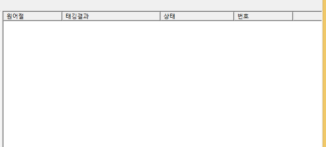
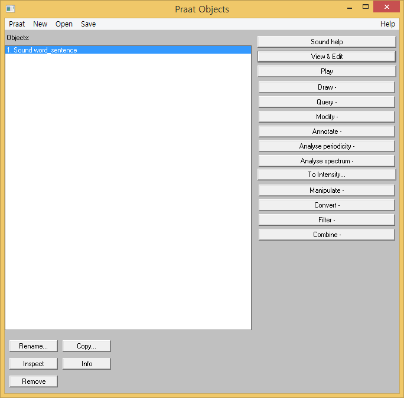
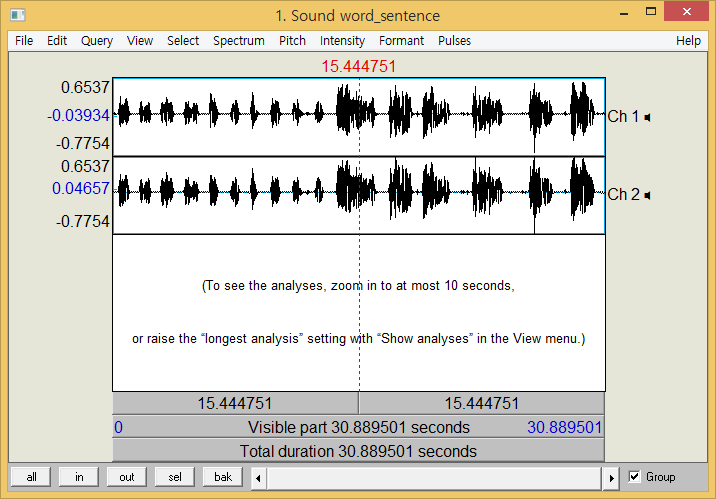
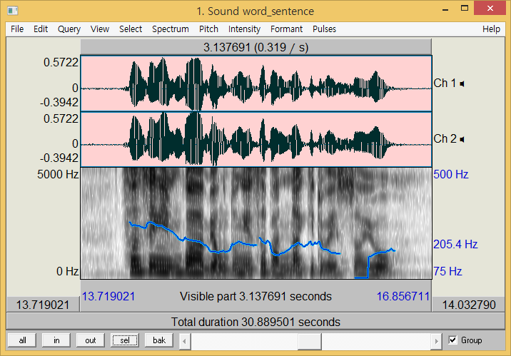
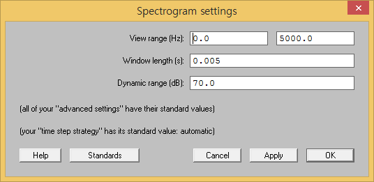
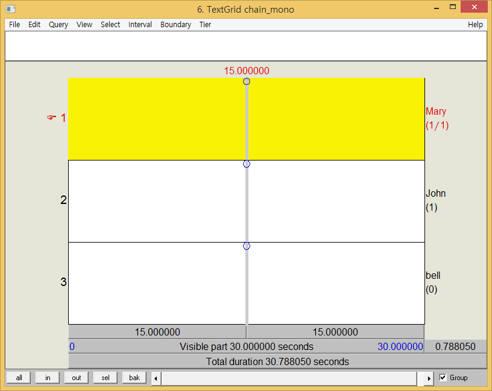
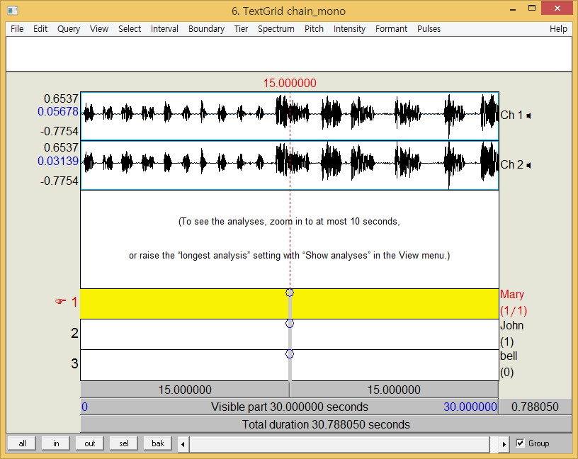

# 한국어 정보처리

------

## 2019.03.06

- '한국어 정보 처리 입문' 교재 참고
- 80년대 시작, 90년대 활발히 연구하여 2005년도 쯤부터 정리된 내용들이 책으로 출간 (입문서)
- 그런데 이제는 연구분야가 깊고 상세해져서 입문으로는 포괄할 수 없게 되었다.

### 언어란 무엇인가

1. 기호로서의 언어

- '형식'+'내용'
- '기표'+'기의'
- 이미지도 기호, 언어는 기호의 한 종류
- 형식은 음성 언어 / 문자 언어, 내용은 의미

### 정보란 무엇인가

- '정보'라는 단어가 쓰이는 맥락은 시대에 따라 다양하게 변화해왔다

>  '자료를 특정한 목적에 따라 가공하여 얻게 되는 여러 가지 사실들'

#### Q. 데이터와 정보는 무엇이 다른가?

- 데이터는 가공되지 않은 사실들의 모음 

>'특정한 목적에 따라 가공되지 않은 상태의 단순한 여러 가지 사실들'

- 이 자료를 가지고 평균, 표준편차 등을 구해 **유의미**한 결론을 도출해내는 것이 정보(특정한 목적이 존재)

> 情報 : '내 마음속에 있는 것을 명시적인 형태로 만들어 남에게 알린다'

- 컴퓨터에게 언어에 대한 지식을 습득시키려면 사실 명시적이고 분명한 기준을 컴퓨터에게 제시해주어야 한다. 이것이 정보 처리의 기초가 된다.

#### Q. 정보와 지식은 또 어떻게 다른가?

- 알아낸 정보가 **보편적**으로 의미가 있다면 이를 '지식'이라고 한다.
- 즉, 일반적으로 통용될 수 있는 정보를 지식이라고 한다.

### 정보를 받아들이는 과정

- 앞서 말한 정의처럼 '유의미'한 정보만 우리에게 받아들여지게 된다.
- 즉, 데이터가 많다고 해서 그것이 다 내게 정보로 작용하는 것은 아니다.
- 예전에는 데이터가 많지 않았기 때문에 데이터 구축이 하나의 과제였는데, 지금은 이미 축적된 데이터가 너무나 많다.

> "너는 나에게 데이터가 아니라 정보야"

### 정보 처리란 무엇인가

- 인간이 얻는 정보의 83%는 시각 정보이다. (prof Sampath)

> '정보를 얻고 기억하고 생산하고 유통하는 모든 과정을 정보처리라고 한다.'

- 현대에 이르러 정보의 양이 기하급수적으로 늘어났다.
- 인간은 신체적 정보 처리의 한계를 극복하기 위해 매체를 만들어냈다.
- 전화, 팩스, 녹음기, 라디오, 신문, TV, 컴퓨터가 그러한 예이다.
- 사실상 현대에 이루어지는 정보 처리의 절대 다수는 컴퓨터를 이용해 이루어진다.

### 정보 처리 과정

​							`데이터 -> 정보 -> 표현`

​					    	`input -> process -> output`

- 위 모델을 IPO 모델이라고 한다.
- 데이터가 정보가 되려면 의미가 있어야 한다.
- 정보는 기호로 인코딩되어 표현되어야 한다.
- 실제 프로그래밍 관련 전공에서 관심을 가지는 정보 처리의 절차는 정보를 표현하는 절차이다.
- 신경망을 이용해 이미지를 분석하는 알고리즘도 이러한 절차 중 하나이다.

### 한국어 정보처리

- 1980년대 중반 이후에 등장
- 컴퓨터를 이용해 연구자료를 정리한다는 의미의 도구로서 접근(기계화/전산화 수준)
- 이후 한국어 정보학의 개념이 도입
- 정보화가 도구가 아닌 그 자체의 목표로 부각되기 시작했다.
- 컴퓨터에 인간의 언어능력을 부과하기 위한 목적으로 연구 ... 전산언어학/자연어 처리
- 본래는 데이터 정제는 연구자가, 데이터 표현은 개발자가 하는 식의 협업 구도였으나, 요 근래에는 풀스택을 요구하는 경우가 많다.

### 언어 행위와 정보 전달 행위

​         					`발화 행위 -> 음파 -> 청취 행위`

​			`정보 생산 -> 코드 변환 -> 통신 선로 -> 코드 변환 -> 정보 수신`

​					 `정보 생산자 : 인코딩	정보 수신자 : 디코딩`

- 정보 생산이란, 정보의 원천을 분석하고, 그 결과를 토대로 정보를 검색 내지 추출하는 과정이다.
- 코드 변환이란, 정보를 컴퓨터에서 활용할 수 있도록 변환하는 과정이다.

### 한국어 정보처리의 단계와 과제

> 

- 현재 한국어 형태소 분석기의 정확도는 90%정도
- 상용 기준은 95%를 목표로 한다.
- 번역 방식에도 신경망 번역방식을 적용하자 적중도가 훨씬 높아졌다고 한다.
- 구글에선 3년 안에 인간 번역자가 필요 없어질 거라고 발표했다.
- 위 단계를 아래 처럼 세 단계로 나누기도 한다.

1. 기초 분야

- 정보 원천 영역 - 코퍼스(말뭉치) 구축
- 코퍼스란, 언어 연구의 대상이 되는 텍스트 자료의 집합이다.
- 음성 자료를 다루는 코퍼스는 음성 코퍼스라고 지칭한다. => 난이도가 차원이 다르다
- 코퍼스 구축만 해도 굉장히 비싸다!
- cf) 음성 코퍼스 중 사용할 수 있는 유일한 자료는 '서울 코퍼스'

2. 핵심 분야

- 정보 분석 영역 - 언어 분석 도구 개발 영역
- 인간이 언어를 인지하는 인지 과정과 유사한 과정

3. 응용 분야

- 정보 변환 영역
- ㅁ

### 마지막으로

- 은행원의 업무 : 금액에 비례하는 이자율을 매겨 이자를 지급하는 업무 ... 반복 업무
- 이 반복 업무를 기계를 통해서 신속하게 처리하는 것이 컴퓨터의 역할
- 단순 노동을 대체하는 일은 쉽게 진행되었으나, 인간의 지성을 구축하는 일은 쉽게 진척되지 않았다.
- 이후 신경망이 등장하면서 이 판도가 빠르게 뒤바뀌고 있다.
- weak한 인공지능 ... 특정 분야에 특화된 인공지능 (알파고, 이미지 분석기 등등)
- 그러나 아직도 컴퓨터가 해내지 못하는 일들이 상당히 많다.

## 2019.03.11.

- 지난 시간 수업 review
- 7주차 출장으로 3번 휴강 -> 팀프로젝트 시간으로 활용

### 코퍼스란 무엇인가

- 코퍼스를 대상으로 하는 학문 분야도 존재한다.

> 코퍼스란?
>
> 언어 연구의 대상이 되는 텍스트(default)의 집합

- '음성' 코퍼스처럼 수식어가 붙지 않는 한 문자 코퍼스를 일컫는 것으로 이해한다.
- 컴퓨터가 인식할 수 있는 형태의 텍스트, 즉 소스파일을 의미하는 것.
- 말뭉치, 말모듬, 코퍼스, Corpora, 대언어자료기지, Big data 등 다양한 단어로 일컬어진다.
- 넓은 의미의 코퍼스 : 어떤 종류/형식이든 글과 말을 모아놓은 것
  - 조선왕조실록CD(이미지), 이문열 전집(오프라인 북), 외국인 한국어 학습자의 오류(종이) 모음
- 좁은 의미의 코퍼스 : 컴퓨터를 이용한 언어 연구의 대상 (즉, 컴퓨터가 처리할 수 있는 텍스트 파일)
  - 신문기사, 일상대화, 특정 작가의 소설 등
  - 전자화되어 비트로 구성된 것들
- 코퍼스를 구축할 때는 활용할(필요한) 정보들만으로 구성하는 것이 중요하다. (목적지향적 설계)

### 코퍼스 언어학

- 전자 코퍼스를 바탕으로 컴퓨터를 이용하여 언어학적 연구를 수행하는 연구 방식
- 전통적 음운, 문법, 의미, 어휘의 문제를 연구하는 동시에 전자사전, 통계적 자연어 처리 등의 연구 분야를 포괄적으로 포함하는 연구 분야이다.
- #### 발화된 **실제** 언어 자료의 집합체
- <u>균형성</u>, <u>대표성</u>, <u>신뢰성</u>(출처)을 가져야 한다.
- 기계 가독형(machine readable), 전산화된 자료여야 한다.

### 코퍼스의 필요성

- 최초의 개발 동기 : 사전 편찬

- 영화 [말모이] 참조 : 자료를 모아야 사전을 만들지

- 언어 사용 양상에 대한 모국어 화자의 불확실한 직관은 객관적 기술에 방해가 될 수 있다.

> 예시)
  >
  > 아버지와 어머니 중 사용 빈도가 높은 것은?
  >
  > 가장 높은 빈도로 사용되는 한국어 명사 10개는?

### 쓸모 있는 코퍼스를 만들기 위한 조건

- 연구자가 알고자 하는 중요 언어 사실을 실제로 포착할 수 있는 것
- 목적지향적이고 필요한 정보에 치중한 정보
- 양적 지향보다는 질적 지향
- 텍스트 수집 과정에서 내용/형태를 변경하거나 누락해선 안 된다.(신뢰성)
  - ex) 음성 전사의 경우 개인의 말버릇이나 사투리를 그대로 반영해서 입력해야 한다.
- 특정한 기준에 의해 선택된 것이어야 한다.(대표성, 균형성)

### 코퍼스의 효용

- 코퍼스는 아무리 커도 크지 않다. (실제 사용하는 언어에 비하여)
- 코퍼스는 아무리 작아도 무의미하지 않다. (그 안에는 관찰할만한 사실이 존재한다)

### 코퍼스의 역사

#### 국외 코퍼스

- Brown Corpus
  - 1967년 최초의 코퍼스
  - 100만 어절 규모(띄어쓰기 단위)
    - 300쪽 짜리 소설이 대략 5만 어절 정도라고 한다.
  - 브라운 대학에서 구축
  - 대표적인 한계 : 동음이의어 분석을 하지 않았다. (모아두기만 해선 의미가 없다!)
- BNC(영국국립코퍼스)
  - 국가 차원의 개입이 필요한 공공재로서의 가치가 부각됨
  - 중복 예산과 인력 낭비의 문제를 해결하기 위함
  - 1억 어절 규모로, 지속적으로 확장되고 있다. (문자/음성이 9:1 비율)
- ANC(미국국립코퍼스)
- COCA(Corpus of Contemporary American English)
  - 접근성과 활용성이 용이하다.
  - 검색 기능을 통해 빈도, 용법 등에 대한 정보를 바로 입수할 수 있다.

#### 국내 코퍼스

- 우리나라는 1990년대부터 연구하기 시작
- 각자가 개발한 것을 공유하지 않고 있기 때문에 접근하기가 쉽지 않은 편이다.
- 21세기 세종계획 코퍼스
  - 국가 주도 최초의 코퍼스 (고려대, 연세대, KAIST, 국립국어원 등의 코퍼스를 수합하여 표준화함)
  - 1억 어절 규모
  - 영국의 BNC를 모델로 함
  - 1998~2007년 수행 => 국어 정보화의 기초 수립 (150억 규모 사업)
  - 국립국어원 언어정보나눔터에서 제공
  - 독백, 주례사, 연설, 회의 등 키워드별 제공
  - 그러나 2007년 이래로 업데이트가 되지 않고 있다. (사실상 5년 지난 자료는 폐기 대상) => 잃어버린 10년
  - 이렇게 만들어진 코퍼스는 빅데이터, 머신러닝, 인공지능 등 영역에서 필요한데, 자원이 부족한 상황
  - 올해부터 <u>향후 5년간</u> 다양한 코퍼스 구축 계획이 수립중 (4차 산업혁명)
    - 고려대 민족문화연구원, 연세대 언어정보연구원 등
    - https://riks.korea.ac.kr 민족문화연구원 사이트
    - http://corpus.korea.ac.kr 웹개발 코퍼스 분석 도구

### 코퍼스의 종류

#### 자료 유형에 따라

- 문어 코퍼스
  - 텍스트로 구성된 코퍼스
  - 문헌 본래의 텍스트 모습을 그대로 담은 이미지 파일로 구성할 수도 있음
  - 균형 코퍼스 : 문어+구어 텍스트가 균형을 이루도록 구성된 코퍼스
- 음성 코퍼스
  - 구어의 특성이나 음성에 대한 분석을 위한 음성 녹음 

#### 만든 목적에 따라

- 일반 코퍼스
  - 일반적 언어 조사를 위한 코퍼스
- 특수 코퍼스
  - 특정 목적에 맞게 고안된 코퍼스

#### 가공 여부에 따라

- 원시 코퍼스
  - 원문 텍스트 그대로
- 주석 코퍼스
  - 각종 문법적 정보를 붙인 코퍼스
  - 형태 분석 => 품사별 통계 등
  - 동음이의어 분석 => 도시 / 전치사 to와 부정사 to / 숫자 one과 대명사 one
  - 구문 분석 => 통사적 정보(문장 성분) (사실상 정확도가 굉장히 낮음)
  - 평판 분석 => 감정 분석
  - 담화 분석

#### 언어를 대표하는 방식에 따라

- 표본 코퍼스
- 전체 모집단의 대표적 샘플로 구성된 코퍼스
  - 대부분의 국어 코퍼스

#### 확장 가능성에 따라

#### 코퍼스에 반영된 언어의 시대에 따라

- 공시적 코퍼스
- 통시적 코퍼스

#### 그 외

## 2019.03.13.

- 발표 주제 선정
- 언어 분석이 가능하다면 어떤 주제도 가능하다.

### 코퍼스  준비

- 연습 삼아 작은 단위의 코퍼스를 이용해볼 것이다.
- 다음주 화요일까지 간단한 코퍼스를 가져와야 한다.
- 좋아하는 노래 약 30곡 따오기

### 코퍼스의 구축 과정

- 자료 입수 => 저작권 문제, 규모 등에 대한 설계
- 원시 코퍼스 => 헤더, 마크업
- 형태 분석 => 형태 분석 도구
- etc

#### 1. 자료 입수

- 이미 구축된 적절한 코퍼스가 있다면 활용한다.
- 21세기 세종 말뭉치는 학문적 목적으로 사용할 수 있도록 개방되어 있다.
- 그러나 대부분의 코퍼스는 입수하기가 쉽지 않다.
- 전자 텍스트 자료의 경우, 인터넷을 통해 구할 수도 있고, 신문사와 잡지사에서는 1년치 기사를 CD-ROM에 담아 판매하고 있으며, 워드 프로세서로 작성한 문서(이메일, 채팅 등)를 이용할 수도 있다.
- 갖춰야할 조건
  1. 내용의 신뢰성
     - 텍스트 수집, 표준화 등에서 오류가 없어야 한다.
     - 분석 텍스트의 경우 분석의 정확성을 보장해야 한다.
  2. 규모의 적절성
     - 해당 언어의 다양한 특성이 충분히 포착될 수 있어야 한다.
     - 1백만 어절 ~ 1억 어절 이상
  3. 표본의 대표성
     - 텍스트 장르 구성, 구성 비율 등이 해당 언어의 언어 사용 양상을 대표해야 한다.
     - 문어와 구어의 비중을 고려해야 한다.

#### 2. 원시 코퍼스

- 헤더
  - 텍스트의 서지적 특성
  - 저자, 출판사, 샘플링 방법, 수정 내용 등
  - JSON 형태로 기록된다.
  - ppt 사진 참조
- 마크업
  - 텍스트 내부 정보를 부호화하기 위한 정보
  - 문단, 제목, 저자, 날짜, 장 정보 등 -> p, head, author, date, div 태그

#### 3. 형태분석 코퍼스

- ppt 사진 참조
- 보통 엑셀을 이용해서 처리한다.
- 21세기 세종계획의 지능형 형태소 분석기를 사용한다면 품사 집합에 따른 태그를 알고 있으면 좋다.

## 2019.03.18.

### 지능형 형태소 분석기

- 블랙보드에서 다운로드
- 분석기를 활용하기 위해서는 한국어 통사 구조에 대해서 어느정도 알고 있어야 한다.
- 단어를 우선적으로 구분하기 때문에 띄어쓰기가 제대로 되어 있어야 한다.

### 단어

- 최소 자립 형식(minimal free form - bloomfield, 1933)
  - 형태론적으로 다른 요소의 도움 없이 문장에서 홀로 쓰일 수 있는 요소

> 그 / 나무 / 아직 / 안 / 심었다 (5단어)
>
> 조각구름 / 이 / 저 / 높은 / 하늘 / 에 / 걸려 / 있다 (8단어)

- 비분리성
  - 사이에 무언가를 넣어서 분리할 수 있는가?

> 큰아버지 vs 큰 아버지
>
> 전자는 분리가 불가능하지만, 큰 아버지는 큰 멋진 아버지 처럼 분리가 가능하다.

=> 최소 자립 형식 + 비분리성 = 분리성이 없는 최소 자립 형식

- 조사
  - 늘 체언에 붙어 쓰여 자립성이 없지만
  - 선행 체언의 자립성을 감안하여 단어의 범위에 포함하기도 한다
  - cf) 어미는 자체와 선행 용언이 모두 자립성이 없다.

### 형태소

- 단어보다 작은 단위

> 조각 / 구름 / 이 / 저 / 높 / 은 / 하늘 / 에 / 걸 / 리 / 어 / 있 / 다 (13형태소)

- 더 이상 분석하면 뜻(기능)을 갖지 못하는 요소

- 뜻을 가지는 가장 작은 요소를 형태소라고 정의할 수 있다.

- 최소의 의미 단위(minimal meaningful unit)
  - 어휘적 의미 : 하늘, 맑-
  - 문법적 의미 : 이, -다

- 형태소의 구분

  - 자립 형태소 : 문장에서 홀로 쓰이는 형태소

  - 의존 형태소 : 다른 형태소에 의존하는 형태소. 의존하는 방향에 '-'를 붙여서 표시하기도 한다.

    or

  - 실질 형태소 : 실질적인 의미를 가지는 형태소

  - 형식 형태소 : 형식적 의미를 가지는 형태소

  

- 형태와 이형태
  - **형태소**는 겉모습이 아니라 내용에 따라 규정되는 **추상적인 개념**이다.
  - 이러한 추상적 개념이 **특정한 모습**으로 나타날 때 이것을 **형태**라고 한다. 
    - ex) 주격조사 '이', '가', 과거 시제 선어말 어미 '-았-', '-었-', '-였-'
  - 둘 이상의 형태가 하나의 형태소에 속할 때 각 형태를 해당 형태소의 이형태라고 한다. (형제격)
    - ex) '이'와 '가'는 각각 주격 조사의 형태인 동시에 이형태
    - 음운론적 조건에 의한 이형태 : '-았-', '-었-'
    - 형태론적 조건에 의한 이형태 : '-였-'

- 이형태의 교체

  - 둘 이상의 이형태가 특정 언어적 조건에서 달리 선택되어 쓰이는 형태
  - ex) '값' ... '갑ㅆ', '감', '갑', '깝', '깝ㅆ' 등등...

- 기본형

  - 한 형태소에 둘 이상의 이형태가 대응할 때 그것들 중 어느 하나를 대표로 삼아 기본형을 설정하기도 한다.
  - 이형태들의 도출 과정에 적용될 규칙 가운데 어떤 것이 더 자연스러운지에 따라 결정됨.
  - 역사적으로 먼저 쓰이거나, 더 자주 쓰이는 것
  - 기준이 없다면 그냥 임의로 선택

### 형태소 분석

- 띄어쓰기 중요!
  - 단어 단위로 띄어 쓰되, 조사는 붙여 쓴다.
  - 전문용어, 고유명사는 붙여 쓴다.

## 2019.03.20.

- 지능형 형태소 분석기는 txt 파일만 인식하므로, 미리 전처리하여 활용하도록 한다.
- 왼편 에디트 박스로 직접 문장을 입력하거나, 파일 열기를 통해 txt 파일을 불러올 수 있다.
- 예전과는 달리 오늘날에는 처리 속도가 중요한 판단 기준으로 올라왔다. (처리하는 데이터 양이 방대해졌으므로)
- 띄어쓰기가 안 된 텍스트를 처리하는 방식이 판단의 기준이 되기도 한다.
- 고유명사, 신조어를 어떻게 처리하는가, 역시 성능 판단 기준이다.

- 원어절 : 문서에 포함된 각 어절
- 태깅결과 : 각 어절에 대한 품사 부착 결과
  - 더블클릭 / 스페이스바 누르면 다양한 형태소 분석 결과가 나오게 되고, 이중 원하는 것으로 수정할 수 있다.
  - 수정한 내용을 동일한 모든 어절에 적용시킬 수 있다.
- 상태 : 해당 어절이 규칙에 의해 품사가 부착된 어절인지, 통계 기반 품사 부착기를 통해 품사가 부착된 어절인지, 또는 미등록어가 부착된 어절인지 표시
  - 규칙 : 규칙에 의해 품사 부착
  - 수정필요 : 미등록어가 포함되어 잇다
  - 아무 표시가 없다면 통계 기반 품사 부착기를 활용
- 번호 :  해당 어절이 몇 번째 어절인지 표시

- 임의대로 정렬이 가능하나, 많은 시간이 소요되는 경우도 있다.

- 작업이 마무리되면 반드시 어절 번호로 정렬한 뒤에 저장해야 한다.

  

### 띄어쓰기가 되어 있지 않은 자료는 어떡해야 할까? 

- 자바 기반의 KoLNPy를 사용해보자.

### 형태소 분석기 실습

1. 수업 중 제시된 2개 문장 분석하기
2. 개별 구축 코퍼스(노래가사)를 활용하여 형태소 분석 -> 일요일까지 제출
   - 원자료
   - 형태소 분석(수정)
   - 관찰한 사실 기술(예시와 함께)

- 단, 위 분석기는 통계 내주는 기능이 없으므로, 파이썬의 단어 빈도 분석 기능을 이용한다

> 링크 참조 : https://m.blog.naver.com/rjs5730/220981013264

### 실습1

- 한 글자로 이루어진 형태소에서 오류가 많이 발생한다.
- 109 어절 중 4-5개 정도 틀린 부분이 검출되었다.

## 2019.04.01.

### SynKDP

- 소리 나는 대로 전사한 자료를 활용해야 의미가 있다 ... 특히 음소, 음절 빈도
- 음소 분석 했을 시 'ㅇ'가 많이 나오는 것도, 발음 나는 대로 전사할 시 결과가 달라질 것
- 전문가 탐색창이 가장 강력한 기능
  - 음운 현상 적용의 대상이 되는 음소열 검색 (주로 초성+중성)
  - 초성+중성, 중성+종성 검색 ... 문체 분석에도 주요하게 쓰일 것
- 일부 음운 현상을 제외하면 대부분 자음과 자음 사이 일어나는 현상
- 노래 가사 코퍼스에서 종성 'ㄹ'가 많이, 종성 'ㅇ'가 적게 사용되는 현상이 많이 보고되고 있다! 흥미로운 결과
- [한국어의 말소리] by 신지영 참고

### 팀프로젝트 평가 방식

- 개인보고서를 통해 본인의 기여도를 서술하고, 동료평가를 시행한다. (5월 19일)

- 즉, 같은 조에서도 다른 점수를 받을 수 있는 것

- 보고서는 개별 보고서(각기 작성) + 팀 보고서(1개로 요약)로 구성된다.

- 이후 계획...

  - 4월 7일 : 주제 확정안 제출
  - 4월 10일 : 연구 주제 발표(조별 3-5분)
  - 4월 14일 AntConc 실습 결과 발표
  - 4월 15/17일 조별 활동
  - 4월 22일 휴강
  - 4월 24일 조별 활동 점검(자율적)
  - 4월 28일까지 최소 2회 이상 조모임 보고서 제출 (일시, 장소, 참석자, 주요 내용, 결정 사항과 다음 과제, 인증샷 등, 매번 다른 사람이 제출할 것)

### AntConc

- Conc 프로그램이므로 코퍼스를 불러와서 사용한다.
- UTF-8으로 인코딩 된 txt 파일만 읽어올 수 있다. (Global Settings -> Character Encoding과 일치)
- 총 7개의 툴을 제공한다.

#### 1. concordance

- 검색 키워드를 포함하는 결과 리턴

- words/case/regex : 어절/대소문자/정규식 필터
- words 선택 시 완전 일치 항목만 리턴한다
- advanced : 여러 검색어를 한번에 검색 가능/맥락정보 추가 가능(왼쪽/오른쪽에 어떤 단어가 수반되는 경우만)
- search window size : 표제어 앞뒤로 표시할 글자 수 지정
- show every Nth row : 표시된 행 수 제한(기본값 1)
- kwic sort : 일치 선 재정렬 (0:검색 단어, L:왼쪽 단어, R:오른쪽 단어)
- clone results : 현재 검색 결과를 복사

## 2019.04.03.

#### 2. concordance plot

- 바코드 형식으로 된 검색 결과를 보여줌.
- 텍스트의 길이는 막대의 너비로 표준화되고, 각 표제어는 막대 내의 세로 줄로 표시된다.
  - 검색 결과가 대상 텍스트에 나타나는 위치와, 대상 검색어가 포함된 파일을 알아볼 수 있다.
  -  ex) 대본 텍스트 내에서 특정 인물이 어느 정도 빈도에 어느 위치에 나오는 지를 알아볼 수 있다.

#### 3. file view

- 개별 파일의 원시 텍스트 표시
- 다른 도구에서 생성된 결과를 자세히 조사하고 싶을 때 활용할 수 있다.

#### 4. clusters

- 단어 또는 패턴을 검색하고 검색 용어의 왼쪽 또는 오른쪽에 n(cluster size)개의 단어를 묶어서 리턴
- range는 해당 키워드가 'n개의 파일에 들어있다'는 조건을 의미한다.

#### 4-1. N-grams

- 'N'단어 클러스터에 대한 전체 자료를 검색할 수 있다.
- 코퍼스에서 공통 표현식을 찾는 데 사용한다.
- 'n개 묶음' 표현의 빈도수를 찾는 데 유용하다.

#### 5. collocate

- 검색어의 조합 검색
- 비순차 패턴도 검색 가능
- 전체 빈도, 왼쪽/오른쪽, 단어의 시작/끝에 배치된 단어의 관련성을 확인할 수 있다.
- 총 Freq의 조합 중 Freq(L)에 n개, Freq(R)에 n개 ... Stat : 검색어와 연어 사이의 통계적 값
- Tool Preference에서 해당 통계 옵션을 선택할 수 있따(기본 MI)

#### 6. wordlist

- 코퍼스 전체 내 단어 사용 빈도를 리턴
- 특정 단어의 빈도수를 찾고 싶다면 search only

#### 6-1. lemma list

- 사전에서 검색할 수 있는 사전의 기본형을 말한다.
- lemmatization : 문장 속에서 다양한 형태로 활용된 단어를 기본형으로 바꾸어 주는 것
- 활용형의 리스트를 가져와야 한다.

#### 7. keyword list

- 단순히 word list의 빈도수를 뽑는 건 크게 의미가 없다
- 대상 말뭉치와 참조 말뭉치의 단어를 비교하여 키워드 목록을 보여주는 기능
- 핵심어의 차이를 통계적 기대치를 기반으로 비교한다
  - ex) 문과 논문뭉치와 이과 논문뭉치의 핵심어를 비교해본다면?
  - ex) 토론에 사용된 키워드와, 일상에서 사용된 키워드 비교
- 반드시 참조 코퍼스가 필요하다!
  - tool preference -> keyword list -> reference corpus에 추가 -> load
- keyness
  - 우연히 발생되는 것으로 예상되는 것보다 더 자주 텍스트에 등장하는 단어
  - 텍스트의 단어 빈도를 일반적인 언어 사용에 대한 참조로 사용되는 훨씬 큰 코퍼스에서 파생 된 예상 빈도와 비교한다
- 빈도가 낮은 키워드를 찾고 싶다면, tool preference에서 show negative keywords에 체크

## 2019. 04. 15 - 17

### 조별 토론

## 2019. 04. 22 - 24

### 시험 기간

## 2019. 04. 29.

### 중간 보고서 제출

- 5월 15일까지 <논의> 부분을 제외한 내용이 온전한 채로 제출
- 5월 27일 ~ 6월 12일에 걸쳐 발표 진행
- 개별 피드백(5) + 조별 토론(5)

### Pajek

- 거미라는 뜻의 슬로바키아 어 - '파이옉'이라고 읽는다.
- 김용학 <<사회 연결망 분석>> ... 파이옉의 이론적 측면
- 이수상 <<네트워크 분석방법의 활용과 한계>> .. 파이옉의 실용적 측면
- 빅데이터를 통해 유의미한 정보를 얻기 위해서는 필연적으로 계량적, 통계적 접근 방법을 활용해야 한다.

### 키워드

- 키워드성(keywordness) : 어떤 단어가 키워드로 선택될 것인가에 대한 정도를 나타내는 용어
- 이는 AntConc를 사용해도 알아낼 수 있는 부분이다. (T점수)
- 키워드성이 높을수록 그 단어는 해당 문서를 대표하는 키워드로 선정될 확률이 높다.
- 단순히 많이 출현했다고 해서 키워드가 될 수 있는 것은 아니다!
- 해당 주제에서 '많이' 사용되고, 다른 주제에서 '적게' 사용되는 것이 키워드(즉, 상대적 개념)

### 공기어

- 어떤 단어와 일정한 문맥에서 '함께' 출현하는 단어를 의미한다.

- 문장 단위일수도, 문단 단위일수도 있다. (그러나 문단 단위를 선호)

- 문단 -> 하나의 주제의식을 담고 있는 생각의 덩어리

- 대상어의 사용 양상을 문맥에 맞게 좀더 구체적으로 확인할 수 있다는 의의가 존재

  - 다만, 대상어의 특성을 온전히 보여주는 데는 한계가 있다.

  - 우연히 빈도가 높게 나타나는 경우를 경계해야 한다.

  - 해당 대상어와만 '특별히' 공기한다는 정보를 포착해야 한다.

    ex) '안타깝다'는 '사람'과, '애달프다'는 '사물'과 공기한다, 등등

### 네트워크

- 일정한 수의 노드(절점)와 그 노드들 사이의 링크(연결선)의 집합
- 노드에는 표지가 붙고, 링크에는 값이 부여될 수 있음
- 허브 : 모든 노드와 연결된 공기어
- 링크 값이 (1)이라면 해당 노드와만 관련이 있다는 것. -> 키워드성 혹은 연도/주제/카테고리별 특성 반영
- 문제는 이러한 네트워크를 '구성'하는 것이 아니라, 여기서 의미를 추출해내는 것이다.
- 어떤 단어의 특성을 정확히 파악하고, 그 사용 양상의 변천 과정을 밝히기 위해서는 단어와 공기어가 형성하는 네트워크를 분석할 필요가 있다.
- 문맥은 시대와 상황에 따라 다양하게 변화하기 마련이므로, 이러한 네트워크 분석 방법은 대상어와 공기어가 보이는 변화의 양상을 적절히 포착해줄 수 있을 것으로 기대된다.

### 유사  프로그램

- Pajek, UCINET, MetMiner가 대표적
- 대규모 네트워크를 시각화해주는 기능 + 네트워크 연결 정도 등에 대한 정보를 제공해준다.
- pajek은 특히 대규모 코퍼스를 분석하는 데에 유용하다. + 결과물의 해상도가 좋다.

### 네트워크 분석 예시 (1)

- 김일환(2011) <공기어 네트워크의 변화 양상: '가족'과 '친구'를 중심으로> (2000-2009년 대상)
- 단어의 변화는 문맥의 변화를 전제로 한다. ex) 소통
- 따라서 주변 문맥을 살피는 일이 필수적이다.
- 이러한 대상어와 공기어의 변화는 시대적 흐름과 관심사를 반영하는 것이다.
- 즉, 사회적 관심사의 변화 추이를 계측할 수 있는 단서가 된다.

### 방법론

- 공기어의 추출 범위를 3어절 내외/문장 단위가 아닌, 문단 단위로 확장한다.
- 문단 단위의 공기어 추출은 문단이 하나의 화제를 중심으로 구분되는 단위라는 점을 고려할 때, 대상어와 공기어의 관련 양상을 적절히 포착할 수 있는 관계로 사료된다.
- 고립된 공기어 vs 공통된 공기어 ... 연도별 차이점과 공통점을 반영
- n개의 노드에 대해서 n의 값을 가지는 공기어가 허브, n에 가까운 값을 가지는 공기어는 '준'허브라고 한다.
- 동사/형용사는 활용형이 다양하기 때문에 분석이 어렵다는 점에서 명사를 분석하는 경우가 많다.
- 상위 공기어의 순위를 10개, 20개, 50개로 점차적으로 늘려가며 확인해보는 이유는, 우선순위가 무엇인지를 단계적으로 알아보기 위해서이다.
- 공기어의 개수를 늘리면 준허브에 해당했던 공기어가 허브에 포함될 가능성이 높아진다. (즉, 준허브 =~ 허브)
- 허브/준허브/고립어 외에 나타나는 공기어의 의의는 얼마든지 해석의 여부에 달려있다.

### 네트워크 분석 예시 (2)

- 김일환, 이승연(2012), <형용사 유의어의 공기어 네트워크 분석: '안타깝다' 류의 형용사를 중심으로>

- 가엽다/불쌍하다/딱하다/안쓰럽다/안타깝다 ... 유의어 관계의 대상어들과 그 공기어들을 분석

- 고립어와 허브의 분포를 통해 맥락을 유추해낼 수 있다.

- 이를 외국어 교육용 교재에 적용했더니, 맥락이 잘못 적용된 예시들을 발견할 수 있었다.

  

## 2019.05.06.

### 대체공휴일

## 2019.05.08.

### pajek 실습

- 네트워크를 단순히 그리는 것이 중요한 게 아니라, 왜, 어떻게 분석하는지가 더 중요하다.
- 가중치를 이용, 계층도를 그릴 수 있다.
- 원형 형태의 그림 ... 결점의 위치가 네트워크에서의 구조적 위치를 통해 계산된 것이 아니라, 결점 번호 순서대로 배열된 것
- 가중치는 노드의 크기, 화살표의 두께나 선명도 등 다양한 방식으로 반영할 수 있다.
- layout - energy - 에서 두 가지 표현 방식 중 하나를 골라 그림의 형태를 손볼 수 있다.
- 이때 나오는 결과물은 랜덤하게 생성되기 때문에 ctrl + k 를 통해서 재생성이 가능하고, 마우스를 통해 노드를 이동시킬 수도 있다.
- 네트워크 밀도/연결정도를 통해 연구 자료의 객관적 수치를 제공할 수도 있지만, 주된 의의는 시각화에 있다.
- 키워드가 많아질수록 시각화 결과물이 복잡하기 때문에, 포괄성/연결정도/밀도/중심화 지표 등을 이용하여 이를 단순화할 수 있다.

### Fruchterman Reingold 

- 타원형을 기본 형태로 가장 큰 구성 집단을 펼치는 방식

### Kamada-Kawai

- 직사각형을 기본 형태로 노드를 겹치지 않게 표현하는 방식

### 프로그램 내부 변수들

#### networks

- .net 파일을 불러와서 작업 대상으로 설정하는 과정
- 기본적인 네트워크를 그릴 수 있고, 하위 변수들을 추가함으로써 보다 상세한 분석이 가능해진다.
- draw 탭에서 원하는 변수 요인을 추가하여 그림을 그린다.

#### partitions

- 네트워크 안의 집단들의 특징들을 보이기 위한 작업
- network - create partition - degree - all로 생성
- input : 공기어가 대상어로부터 받는 관계
- output : 대상어가 공기어로부터 받는 관계
- all : 둘 다 포함
- 수치가 크게 차이나지는 않는다.

#### vectors

- network - create vector - centrality - degree - all로 생성

#### permutations

#### cluster

#### hierarchy

### 그림 내부 설정

- layout - energy - 위에서 설명한 두 개의 형식 중 하나를 선택 가능
- layers - in y direction -> 가중치를 계층적으로 표현
- options - transform - layout 2d -> 회전 가능

### 네트워크 관련 지표

#### 네트워크의 밀도

- 가능한 총 관계수 중에서 실제로 맺어진 관계의 비율 : 2/n(n-1)
- 0에서1 사이의 값으로 도출된다.
- 값이 높을수록 연결관계가 촘촘하다.
- ex) 0.005라면, 연결 정도가 매우 낮다고 얘기할 수 있다.
- network - info - network - general - enter로 불러올 수 있다.
- density 2가 일반적으로 쓰는 밀도
- density 1은 자기 자신에게 돌아오는 회귀(loop) 값을 포함하여 계산한 것으로, 불필요한 경우가 포함됐을 확률이 높다.

#### 네트워크의 연결 정도

- 한 결점이 맺고 있는 다른 결점의 숫자로 정의된다.
- 많은 단어와 연결을 맺고있을수록 네트워크의 핵심 키워드로 기능한다는 의미
- 파티션이 생성된 상태에서 partition - info - 두 번째 상자에 전체 노드 수 입력
- dimension : 총 노드의 수
- the lowest/highest value : 최소/최대의 연결값 (가장 적은/많은 노드와 연결된 노드의 링크 수)

## 2019. 05. 13.

### 음성분석 방법론

- 녹음기 선택 : 표본 추출률 16kHz 이상이면 괜찮다!
- 양자화 16bit 정도면 괜찮다!
- 요즘에는 핸드폰이나 노트북을 이용할 수 있다.
- 파일 형식이 wav인 경우가 적합하다

#### 표본 추출률이란

- 아날로그 신호(음성)를 디지털로 변환

- 이떄 음성 곡선을 각 구간의 점으로 표현한다.

- 200Hz란, 1초에 200개의 점을 찍어 기록한다는 의미이다.

- 표본추출율이 높아질수록 저장해야 할 정보가 많아져 용량이 커진다.

- 따라서 지나치게 높을 필요도 없다.

- 원신호에서 우리가 관심을 두는 **최대 주파수의 두 배 이상** 값을 적정값으로 한다.

  ex)기본 주파수가 200Hz일 때, 표본추출율을 400Hz로 한다.

- 가청 주파수 범위가 20~20,000Hz라고 한다면, 음성에 중요한 정보는 8,000Hz 정도고, 따라서 표본추출률은 16,000Hz~22,050Hz를 사용한다.

#### 양자화란?

- 비트심도라고도 한다.
- 진폭의 정보를 어느 정도로, 얼마만큼 나눠서 담을 것인가의 기준이다.
- 8bit 녹음은 2의 8제곱인 256개로 나눈다는 의미이다.
- 값이 높을수록 원신호에 가까운 복원 방식이 된다.
- 요즘엔 16~32bit 정도를 적정선으로 여긴다.

#### 그밖에 고려할 것들

- 녹음 장소 : 방음이 잘 되고 조용한 곳
- input level 조정 : 녹음기와 화자의 거리, 녹음기의 input level을 조절하여 잡음이 없고 가장 큰 음성이 녹음될 수 있도록 조정해야 한다.
- 차 안이 제법 괜찮은 환경
- 또한 실내에서 할 때는 단단한 벽에 소리가 튕겨나올 수 있으므로, 이불을 까는 것이 좋다.
- 즉, 좁고 밀폐되어 있으며, 바닥과 벽이 단단한 재질인 것이 좋다.
- 녹음기와 화자의 거리는 7cm 정도를 적정선으로 본다.
- input volume이 낮을수록 주변 소음이 덜 들리기 때문에 거리는 적당히 가까운 것이 좋다
- 잡음이 적고, 목소리가 커야 좋은 녹취록이다
- 분석 시에 파형이 잘리거나(너무 시끄러운 경우) 가운데로 수렴하는 경우(너무 소리가 작은 경우)는 적합하지 않다.

### 음성분석기 praat

- 암스테르담 대학에서 만들어진 음성분석 및 합성 프로그램
- '말소리'라는 뜻의 네덜란드어
- 웹에서 다운로드가 가능한 프리웨어이다.
- 개발자가 젊기 때문에 계속해서 유지 보수가 이루어지고 있으며, 개발자에게 직접 문의할 수도 있다.
- http://www.fon.hum.uva.nl/praat/ 를 참조한다.

#### 사용 준비

- 분석은 praat이 유용한 도구들을 많이 제공해주고 있지만, 통계/시각화는 R에서 다루는 것이 나을 수 있다.
- 대부분의 메뉴가 파일 유형(음성/텍스트)에 맞게 유동적으로 제공되기 때문에 가장 먼저 파일을 불러와야 한다.
- help -> go to manual page에서 상세 매뉴얼을 참조할 수 있다.
- new -> record mono/stereo sound 기능으로 즉시 녹음이 가능하다.
- open -> read from file로 이미 만들어진 wav 파일을 불러올 수 있다.

> 
>
> 오른편에 메뉴 탭이 생겨났다

> 
>
> view & edit 기능을 클릭하면 이렇게 파형이 제공된다.

> 
>
> 특정 파형을 이렇게 확대해서 분석할 수 있다.

> 
>
> spectrum 탭에서 스펙트럼 설정이 가능하다.
>
> 1) view range : 주파수 범위 설정
>
> 2) dynamic range : 선명도 설정 (35-40-45 정도가 적정)

#### 부가 기능

- 파일을 불러온 후에 오른편에 메뉴목록이 활성화된다.

1. view & edit

- 분석 창 생성
- 위쪽 그림이 파형, 아래쪽 그림이 스펙트로그램이다.
- 파형의 경우, 가로축이 시간, 세로축이 진폭이다.
- 스펙트로그램은 가로축이 시간, 세로축이 주파수, 간격이 진폭인 삼차원 그림이다.
- all : 음성 파일 전체를 한 화면에서
- in/out : 시간을 단축/연장해서 보기
- sel : 특정 부분의 자료만을 참고한다
- bak : 실행 취소
- 파란 선 : 음높이(pitch) 곡선을 나타낸다.
- 여자는 200-300, 남자는 100-200 정도가 적당하다. 
- 원하는 부분만 extract할 수도 있고, combine - concatenate를 통해 다시 합칠 수도 있다.
- 또한 스테레오를 모노로 변경하면 파일의 크기를 절반으로 줄일 수 있어 경제적이다.

2. play

- 음성 파일 재생

3. annotate

- 주석 달기
- labeling : 음성 자료에 언어 정보 표지를 부여하는 것
- annotate -> to text grid

  1. 레이블링 층위/이름 및 개수 설정 부분

  - 3개로 설정하면 3개 층으로 설정하겠다는 의미

  2. 레이블링 층위 중 point tier(지점층) 설정

  - 필요할 경우 끝나는 지점의 특징을 나타내줄 수 있다.

> 
>
> 기본 설정(Mary John Bell / Bell)으로 실행한 경우의 Text grid

- 해당 사운드 파일과 text grid 파일을 동시에 설정하고 view&edit하면 새로운 창의 결과물이 나타난다.

> 

4. convert

- 파일 변환
- convert to mono를 통해 스테레오 파일을 모노로 변환할 수 있다.
- 음성파일을 분석할 때 가장 먼저 해야할 것이 스테레오 파일을 모노로 변환하는 일이다.
- 이후 변환된 파일을 save -> save as WAV로 저장한다.
- 단, 저장시 파일명은 영문으로 하는 것이 좋다.

